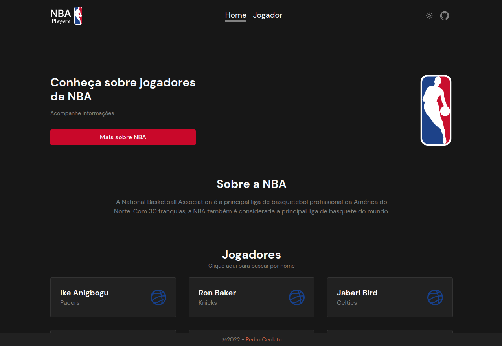
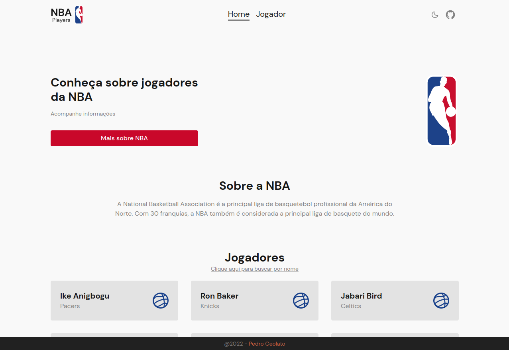

# NBA - PLAYERS

## Aplicação Web para buscar informações sobre jogadores da NBA

 

### 🛠 Tecnologias

As seguintes ferramentas foram usadas na construção do projeto:

- [Next.js](https://beta.nextjs.org/docs/routing/pages-and-layouts)
- [TypeScript](https://www.typescriptlang.org/)
- [Tailwindcss](https://tailwindcss.com/)

 

### ⚙️ API
- [balldontlie API](https://www.balldontlie.io/?ref=publicapis.dev#introduction)

 

---

 

    
    

